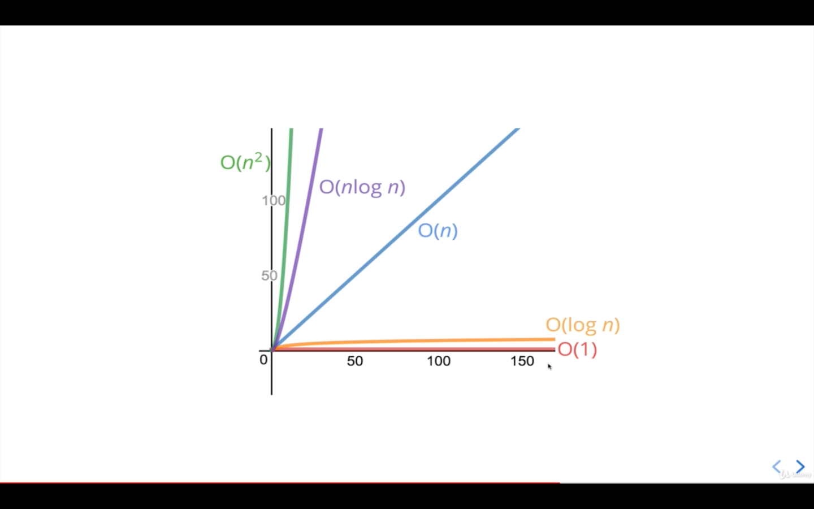

# What's the idea here?

Imagine we have multiple implementations of the same function.

How can we determine which one is the "best?"

<h1>Who Cares? </h1>

It's important to have a precise vocabulary to talk about how our code performs

Useful for discussing trade-offs between different approaches

When your code slows down or crashes, identifying parts of the code that are inefficient can help us find pain points in our applications

<h3>An Example</h3>
Suppose we want to write a function that calculates the sum of all numbers from 1 up to (and including) some number n.

<h1>The Problem with Time</h1>
<li>Different machines will record different times
<li>The same machine will record different times!
<li>For fast algorithms, speed measurements may not be precise enough?

<h1>Introducing....Big O</h1>

1. Big O Notation is a way to formalize fuzzy counting

2. It allows us to talk formally about how the runtime of an algorithm grows as the inputs grow

3. We won't care about the details, only the trends

<h1>Big O Definition</h1>

We say that an algorithm is O(f(n)) if the number of simple operations the computer has to do is eventually less than a constant times f(n), as n increases

<li>f(n) could be linear (f(n) = n)
<li>f(n) could be quadratic (f(n) = n^2)
<li>f(n) could be constant (f(n) = 1)
<li>f(n) could be something entirely different!

<h1>Simplifying Big O Expressions</h1>
<h3> 1: Constants don't matter</h3>

<strike>O(2n)</strike> means O(n)

<strike>O(500)</strike> means O(1)

<strike>O(13n2</strike>) means O(n2)

<strike>O(n+10)</strike> means O(n)

<strike>O(1000n+50)</strike> means O(n)

<strike>O(n2+5n+8)</strike> means O(n2)

<h3 style="color:">So in terms of speed</h3>
<h4>O(1) > O(n) > O(n2) </h4> 

<h1>Big O Shorthands</h1>

1. Arithmatic operations are constants. 

2. Variable assignment are also constants. 

3. Accessing elements in an array (by index) or object (by key) is constant. 

4. In a loop, the the complexity is the length of the loop times the complexity of whatever happens inside of the loop

<h2>
The general trend is something like
</h2>
